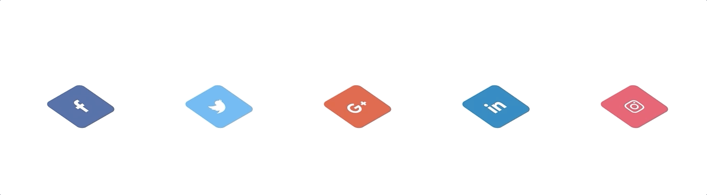
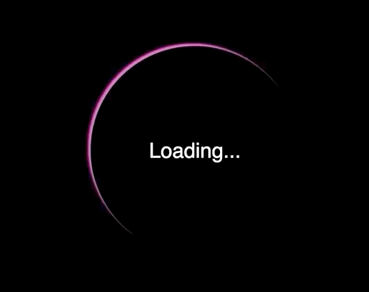
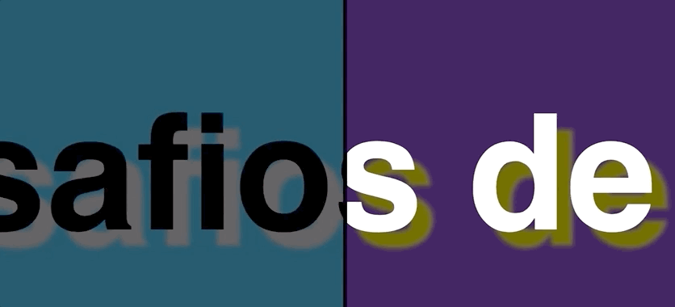
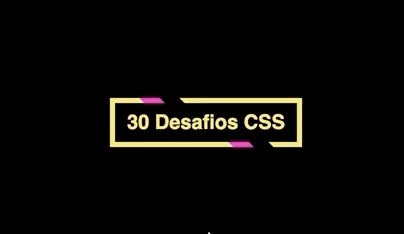
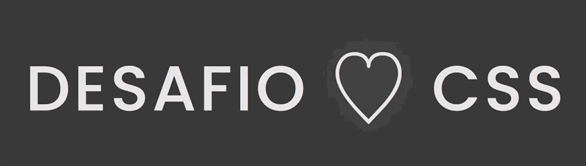
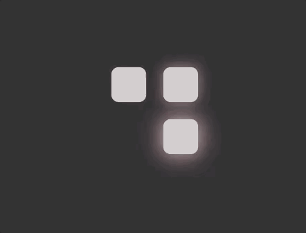
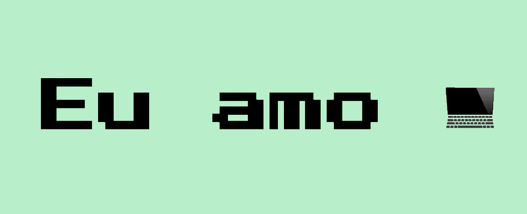
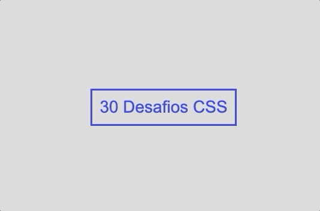

# Desafios CSS

30 desafios de CSS propostos por https://github.com/MilenaCarecho/30diasDeCSS

## Desafio 01 - Ícone de mídia social em camadas

## Desafio 02 - Loader animado

## Desafio 03 - Mudança de cor de texto quando entra em outra div

## Desafio 04 - Botão com efeito

## Desafio 05 - Efeito pulsar

## Desafio 06 - Efeito lightning text

## Desafio 07 - Preloader animado

## Desafio 08 - Coração batendo

## Desafio 09 - Pêndulo de Newton

## Desafio 10 - Animação texto alternando

## Desafio 11 - Botão com efeito hover

## Desafio 12 - Efeito de texto de preenchimento ao passar o mouse

