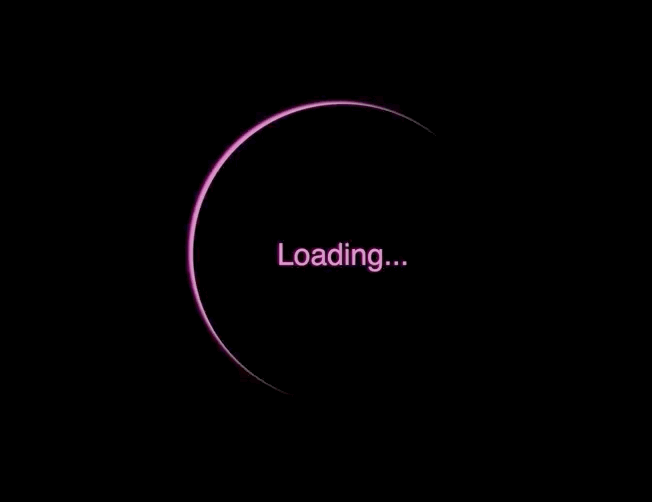

# Desafios CSS

30 desafios de CSS propostos por https://github.com/MilenaCarecho/30diasDeCSS

## Desafio 01 - Ícone de mídia social em camadas

## Desafio 02 - Loader animado

## Desafio 03 - Mudança de cor de texto quando entra em outra div
